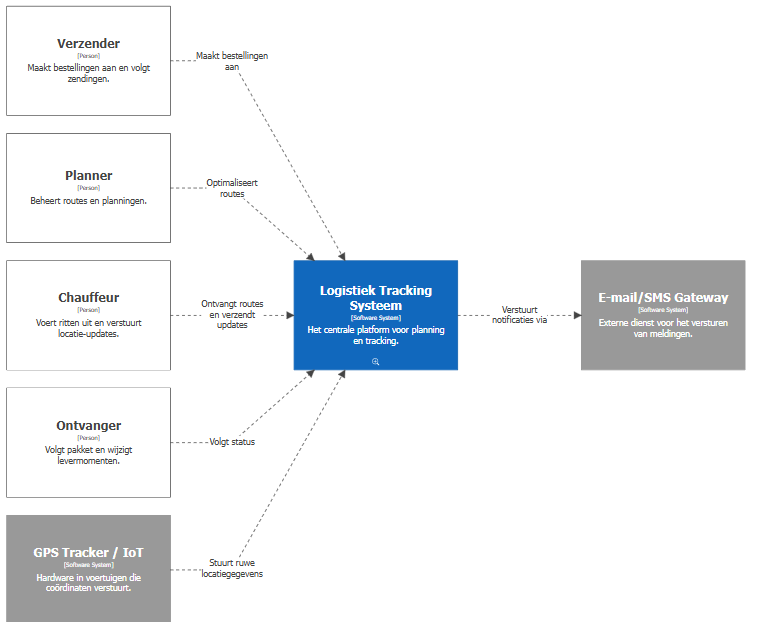
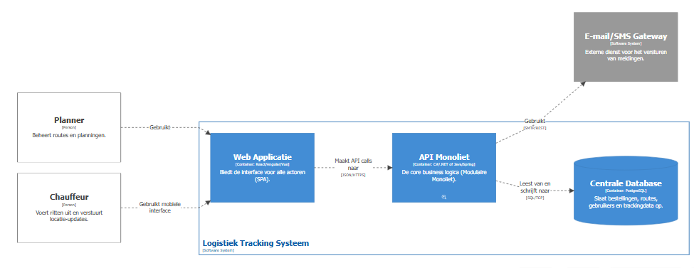
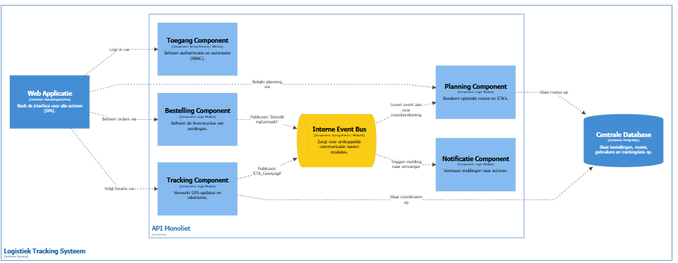

# C4-Model: Architectuur Visie

In dit hoofdstuk leggen we de structuur van ons systeem uit aan de hand van het C4-model. We zoomen stap voor stap in: van de interactie met de buitenwereld tot de interne logica van onze modulaire monoliet.

## Level 1: System Context Diagram (Het overzicht)

Op het hoogste niveau kijken we naar het systeem als een "black box". We focussen ons niet op de techniek, maar op **wie** het systeem gebruikt en met welke **externe systemen** we koppelen. Je ziet hier hoe de Planner, Chauffeur, Verzender en Ontvanger verbonden zijn met het centrale platform.

Daarnaast tonen we de afhankelijkheden met de buitenwereld. Onze applicatie staat niet op een eiland; we ontvangen cruciale data van externe **GPS/IoT trackers** in de voertuigen en versturen updates via een externe **Mail/SMS Gateway**. Dit niveau is essentieel om te begrijpen waar onze verantwoordelijkheid stopt en waar die van een ander systeem begint.



## Level 2: Container Diagram (De applicatie)

In het container-level trekken we de box open en kijken we naar de grofmazige technische bouwblokken. Omdat we hebben gekozen voor een **Modulaire Monoliet**, zie je hier drie hoofdonderdelen: de **Web App** (de frontend waar de gebruiker op klikt), de **API Monoliet** (waar alle berekeningen gebeuren) en de **Centrale Database**.

We houden het deployment-proces simpel en vermijden netwerk-overhead tussen de verschillende domeinen, terwijl we wel een duidelijke scheiding houden tussen de data-opslag en de gebruikersinterface.



## Level 3: Component Diagram (De interne logica)

Dit is het meest gedetailleerde niveau voor deze opdracht. We zoomen in op de **API Monoliet** om te laten zien hoe deze intern is opgebouwd uit de **Logische Componenten** die we eerder hebben gedefinieerd. Je ziet hier de modules voor Toegang, Bestelling, Planning, Tracking en Notificatie als onafhankelijke blokken binnen hetzelfde proces.

Het unieke aan dit diagram is de **Interne Event Bus**. Dit component zorgt ervoor dat onze modules "losjes gekoppeld" blijven. Wanneer de _Tracking Component_ bijvoorbeeld een nieuwe locatie verwerkt, stuurt deze een event naar de bus, waarna de _Notificatie Component_ dit oppikt. Dit bewijst dat we, ondanks dat we een monoliet bouwen, wel degelijk een toekomstbestendige en modulaire structuur hanteren die later makkelijk uit te breiden is.



## Extra: De Interne Event Bus (De "Event Box")

Binnen onze modulaire monoliet functioneert de **Event Bus** als de centrale verkeersleider. In plaats van dat modules elkaar direct aanroepen (strakke koppeling), communiceren ze via een "publiceer-en-abonneer" principe.

#### Waarom deze aanpak?

- **Losse Koppeling (Loose Coupling):** De _Bestelling_-module hoeft niets te weten van de _Planning_-logica. Hij meldt simpelweg dat er een event is, en de rest van het systeem reageert indien nodig.
- **Extensibility:** Willen we later een nieuwe module (bijv. Facturatie) toevoegen? Dan laten we deze simpelweg "luisteren" naar bestaande events zonder de oude code aan te passen.
- **Performance:** Omdat alles binnen één proces draait (in-memory), is de communicatie razendsnel. We hebben de voordelen van een modulaire structuur zonder de vertraging van een netwerk.

#### Praktijkvoorbeeld

Wanneer de **Tracking Component** ziet dat een pakket is bezorgd, gooit deze het event `PackageDelivered` op de bus. De **Notificatie Component** vangt dit op en stuurt direct een mail naar de klant. De Tracking-module zelf hoeft dus geen verstand te hebben van e-mails of notificaties; hij doet alleen waar hij goed in is.

## Deployment Diagram (Infrastructuurview)

Het deployment diagram toont hoe de containers uit het Container Diagram
worden verdeeld over een Docker Swarm cluster van 5 nodes.

### Clusteropbouw

| Node type     | Aantal | Verantwoordelijkheid                       |
| ------------- | ------ | ------------------------------------------ |
| Manager nodes | 3      | Orchestratie, HA, + draaien API en Web App |
| Worker nodes  | 2      | Zware workloads (Planning, Tracking)       |
| Database node | 1      | Geïsolerde PostgreSQL instantie            |

### Waarom deze verdeling?

- **3 managers** garanderen Raft quorum: het cluster blijft functioneel
  bij het uitvallen van 1 manager.
- **Workers voor zware berekeningen**: route-optimalisatie en GPS-verwerking
  zijn CPU-intensief. Door deze op aparte worker nodes te isoleren,
  beïnvloeden ze de orchestratie niet.
- **Dedicated database node**: stabiele I/O zonder concurrentie van
  applicatiecontainers.

### Communicatie

Alle services communiceren via een intern **overlay network**.
Docker Swarm beheert de service discovery automatisch via DNS:
de API bereikt de database simpelweg via de hostnaam `database`.
Extern verkeer komt binnen via de **Swarm Ingress** op poort 80/443
en wordt automatisch gerouteerd naar een beschikbare container.

---

### Structurizr DSL Code

Plak deze code in https://playground.structurizr.com/ voor het C4-diagram.

```structurizr
workspace "Logistiek Systeem" "Architectuur voor Real-time Tracking en Planning" {

    model {
        # Actoren
        planner = person "Planner" "Beheert routes en planningen."
        chauffeur = person "Chauffeur" "Voert ritten uit en verstuurt locatie-updates."
        verzender = person "Verzender" "Maakt bestellingen aan en volgt zendingen."
        ontvanger = person "Ontvanger" "Volgt pakket en wijzigt levermomenten."
        beheerder = person "Beheerder" "Configureert systeeminformatie en rollen."

        # Externe Systemen
        gpsSystem = softwareSystem "GPS Tracker / IoT" "Hardware in voertuigen die coördinaten verstuurt." "External"
        mailSystem = softwareSystem "E-mail/SMS Gateway" "Externe dienst voor het versturen van meldingen." "External"

        logistiekSysteem = softwareSystem "Logistiek Tracking Systeem" "Het centrale platform voor planning en tracking." {

            # Containers
            webApp = container "Web Applicatie" "Biedt de interface voor alle actoren (SPA)." "React/Angular/Vue" "Web Browser"
            database = container "Centrale Database" "Slaat bestellingen, routes, gebruikers en trackingdata op." "PostgreSQL" "Database"

            apiApp = container "API Monoliet" "De core business logica (Modulaire Monoliet)." "C#/.NET of Java/Spring" {

                # Componenten
                accessComp = component "Toegang Component" "Beheert authenticatie en autorisatie (RBAC)." "Spring Security / Identity"
                orderComp = component "Bestelling Component" "Beheert de levenscyclus van zendingen." "Logic Module"
                planningComp = component "Planning Component" "Berekent optimale routes en ETA's." "Logic Module"
                trackingComp = component "Tracking Component" "Verwerkt GPS-updates en telemetrie." "Logic Module"
                notifComp = component "Notificatie Component" "Verstuurt meldingen naar actoren." "Logic Module"
                eventBus = component "Interne Event Bus" "Zorgt voor ontkoppelde communicatie tussen modules." "Spring Events / MediatR" "Message Bus"
            }
        }

        # Context Relaties
        verzender -> logistiekSysteem "Maakt bestellingen aan"
        planner -> logistiekSysteem "Optimaliseert routes"
        chauffeur -> logistiekSysteem "Ontvangt routes en verzendt updates"
        ontvanger -> logistiekSysteem "Volgt status"
        gpsSystem -> logistiekSysteem "Stuurt ruwe locatiegegevens"
        logistiekSysteem -> mailSystem "Verstuurt notificaties via"

        # Container Relaties
        planner -> webApp "Gebruikt"
        chauffeur -> webApp "Gebruikt mobiele interface"
        webApp -> apiApp "Maakt API calls naar" "JSON/HTTPS"
        apiApp -> database "Leest van en schrijft naar" "SQL/TCP"
        apiApp -> mailSystem "Gebruikt" "SMTP/REST"

        # Component Relaties
        webApp -> accessComp "Logt in via"
        webApp -> orderComp "Beheert orders via"
        webApp -> planningComp "Bekijkt planning via"
        webApp -> trackingComp "Volgt locatie via"

        orderComp -> eventBus "Publiceert 'BestellingGemaakt'"
        eventBus -> planningComp "Levert event aan voor routeberekening"
        trackingComp -> eventBus "Publiceert 'ETA_Gewijzigd'"
        eventBus -> notifComp "Triggert melding naar ontvanger"

        planningComp -> database "Slaat routes op"
        trackingComp -> database "Slaat coördinaten op"
    }

    views {
        systemContext logistiekSysteem "ContextDiagram" {
            include *
            autoLayout
        }

        container logistiekSysteem "ContainerDiagram" {
            include *
            autoLayout
        }

        component apiApp "ComponentDiagram" {
            include *
            autoLayout
        }

        styles {
            element "Software System" {
                background #1168bd
                color #ffffff
            }
            element "External" {
                background #999999
                color #ffffff
            }
            element "Container" {
                background #438dd5
                color #ffffff
            }
            element "Database" {
                shape Cylinder
            }
            element "Component" {
                background #85bbf0
                color #000000
            }
            element "Message Bus" {
                shape Pipe
                background #facc15
            }
        }
    }
}
```
